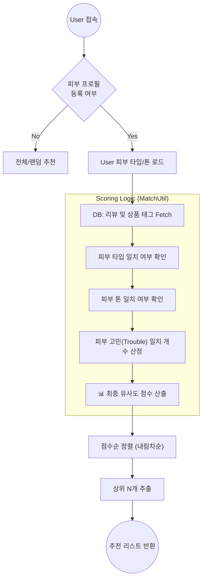
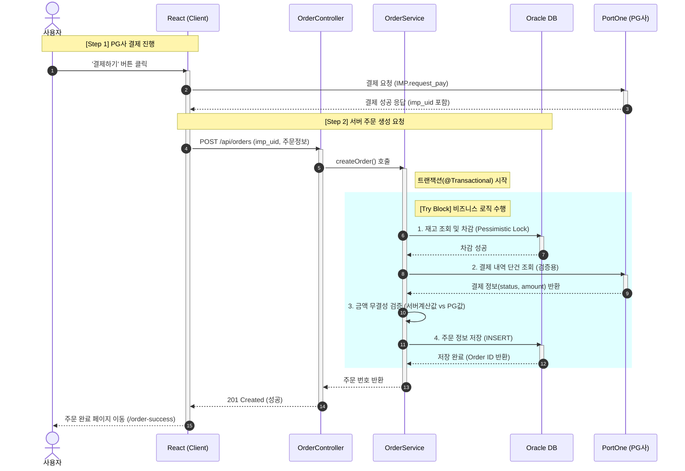
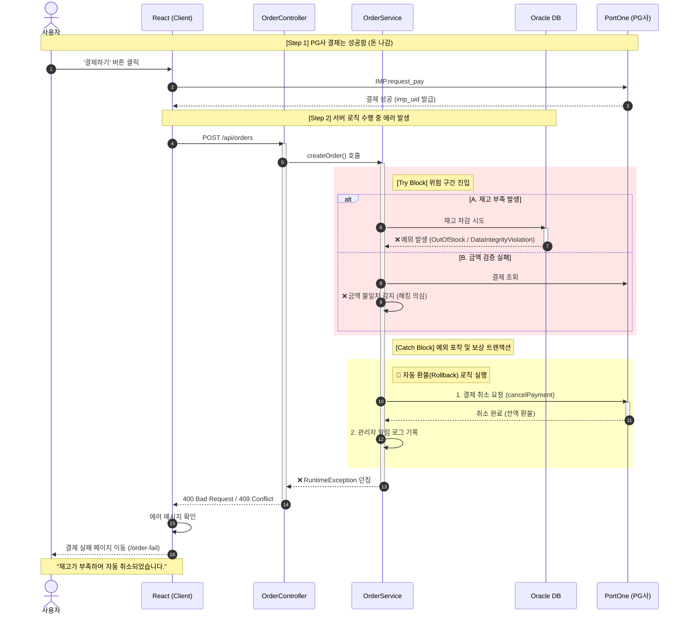
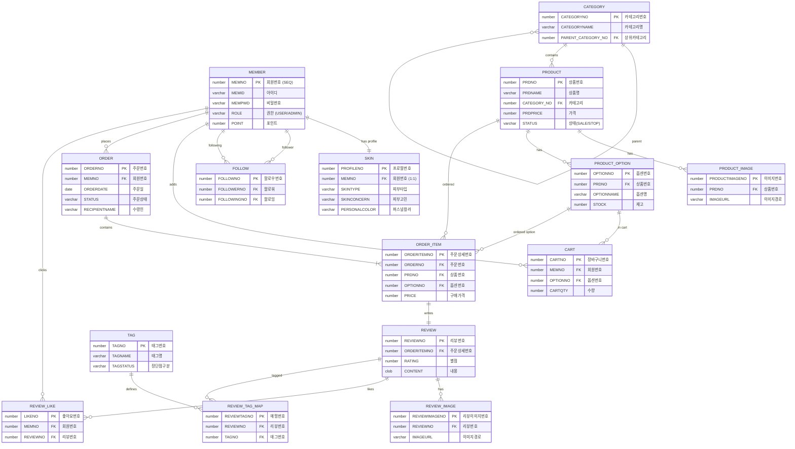
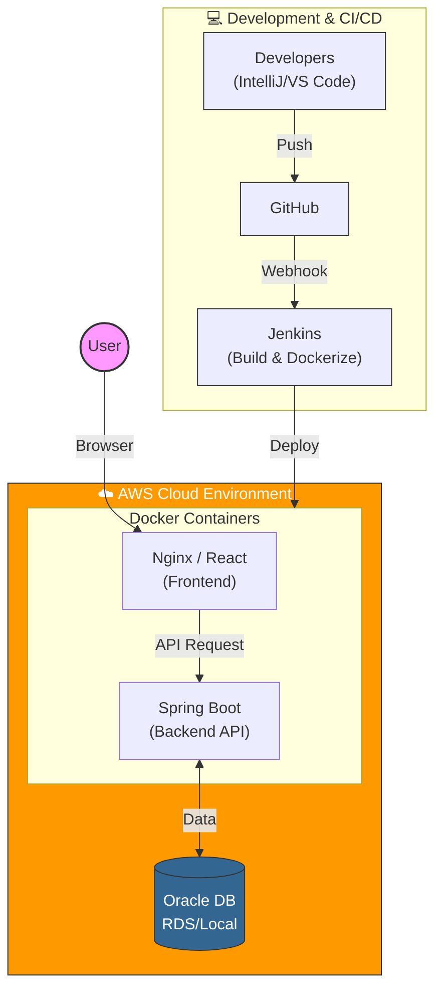

<div align="center">

# Coco Shopping Mall

**사용자 후기 중심 뷰티 커머스**

[](https://www.oracle.com/java/)
[](https://spring.io/projects/spring-boot)
[](https://reactjs.org/)
[](https://www.oracle.com/database/)
[](LICENSE)
[](https://github.com/Tae-co/final-output)

</div>

---

## 1. 목표와 기능

### 1.1 프로젝트 소개 및 목표
**"피부 타입 기반 상품 추천과 사용자 후기를 통한 스마트한 쇼핑 경험"**

**Coco**는 사용자 후기와 피부 프로필을 기반으로 한 뷰티 쇼핑몰 플랫폼입니다. 단순한 상품 판매를 넘어서, 사용자들이 작성한 리뷰와 피부 타입 정보를 활용하여 더 나은 구매 결정을 할 수 있도록 돕는 것이 목표입니다.

- **피부 맞춤형 큐레이션**: 사용자의 피부 프로필(지성, 건성, 웜톤/쿨톤 등)을 분석하여 최적의 뷰티 아이템을 제안합니다.
- **신뢰할 수 있는 리뷰 생태계**: 단순 상품 평점이 아닌, 나와 유사한 피부 타입을 가진 유저(Comate)의 리뷰를 우선적으로 보여주어 정보의 정확도를 높입니다.
- **커뮤니티형 커머스**: 취향이 맞는 유저를 팔로우하고 소통하며 정보를 공유하는 Social-Commerce를 지향합니다.
- **실전형 풀스택 아키텍처**: Spring Boot와 React를 활용한 완벽한 분리형 구조와 JWT 기반의 보안 시스템을 구축하여 실무 수준의 개발 역량을 입증합니다.
- 📂 **최종 산출물 및 발표 자료**: [Final Output Repository 바로가기](https://github.com/Tae-co/final-output)
  - 프로젝트의 최종 발표 자료, 시연 영상, 포트폴리오 문서는 아래 리포지토리에서 확인하실 수 있습니다.

### 1.2 주요 기능
- **회원 및 보안 시스템**
  - 일반 회원가입 및 소셜 로그인 (카카오, 네이버, 구글)
  - JWT Access/Refresh Token 기반의 이중 보안 인증
  - 이메일 인증을 통한 아이디/비밀번호 찾기
- **Co-mate (핵심 기능)**
  - 피부 진단 테스트 및 프로필(피부타입, 고민, 퍼스널컬러) 등록
  - 유사도 알고리즘(매칭률) 기반 친구/상품/리뷰 추천
  - 유저 팔로우/언팔로우 및 활동 내역(작성 리뷰, 좋아요) 모아보기
- **상품 및 쇼핑 시스템**
  - 카테고리별 상품 조회, 검색, 필터링 (피부 타입별 필터 제공)
  - 장바구니 담기, 수량 변경, 선택 삭제
  - PortOne API 연동을 통한 실시간 결제 및 주문 내역 관리
- **리뷰 커뮤니티**
  - 텍스트, 이미지, 태그(장/단점)를 포함한 리뷰 작성
  - 리뷰 좋아요 및 도움이 된 리뷰 정렬
  - '나와 비슷한 피부 타입' 유저의 리뷰만 필터링하여 보기
- **관리자(Admin)**
  - 상품 등록/수정/삭제 및 카테고리 관리
  - 전체 회원 조회 및 포인트 관리
  - 주문 현황 조회 및 취소 처리

- ### 1.3 팀 구성 및 역할 분담
- 이 프로젝트는 **K-Digital Training Java 풀스택 개발자 아카데미 6회차** 최종 프로젝트로, 6명의 팀원이 협업하여 개발했습니다.

| 팀원 / GitHub | 포지션 | 담당 도메인 | 상세 담당 업무 및 기여 |
|:---:|:---:|:---:|:---|
| <br>**신태엽**<br>[](https://github.com/Tae-co) | **PM**<br>Full Stack | **총괄** | • **프로젝트 리딩**: 일정 관리, 코드 리뷰 및 머지, 배포 파이프라인(CI/CD) 구축<br>• **DevOps**: AWS EC2/RDS 환경 세팅 및 트러블 슈팅 |
| <br>**이규리**<br>[](https://github.com/CurieLee-alt) | Full Stack | **Co-mate** | • **추천 알고리즘**: 피부 타입/톤/고민 기반 유사도 분석 및 매칭 로직 구현<br>• **커뮤니티**: 유저 팔로우/언팔로우 및 활동 내역 피드 기능 개발 |
| <br>**이준범**<br>[](https://github.com/LeeJunBeom159) | Full Stack | **장바구니**<br>**마이페이지** | • **장바구니**: 세션/DB 기반 장바구니 로직 및 수량 변경 동기화<br>• **마이페이지**: 주문 내역 조회 및 개인정보 수정, 배송지 관리 구현 |
| <br>**임응규**<br>[](https://github.com/grtleg002) | Full Stack | **주문/결제** | • **결제 시스템**: PortOne API 연동 및 결제 검증(Validation) 로직 구현<br>• **주문 처리**: 트랜잭션 관리를 통한 재고 차감 및 주문 상태 관리 |
| <br>**최승훈**<br>[](https://github.com/shChoi-Dev) | Full Stack | **상품**<br>**관리자** | • **상품 관리**: 다중 이미지 업로드(Local) 및 카테고리별 필터링 조회<br>• **관리자 페이지**: 상품 등록/수정/삭제(CRUD) 및 대시보드 통계 시각화 |
| <br>**추현민**<br>[](https://github.com/chewbitdev) | Full Stack | **회원**<br>**보안** | • **인증/인가**: Spring Security & JWT 기반 로그인/로그아웃 시스템 구축<br>• **OAuth2**: 카카오/네이버/구글 소셜 로그인 연동 및 회원가입 처리 |

## 2. 개발 환경 및 기술 스택

### 2.1 Backend

| 기술 | 버전 | 용도 |
|:---:|:---:|---|
| **Java** | 21 | 메인 프로그래밍 언어 |
| **Spring Boot** | 3.5.7 | 웹 애플리케이션 프레임워크 |
| **Spring Security** | - | 인증 및 권한 관리 (Security Filter Chain) |
| **Spring Data JPA** | - | ORM 기반 데이터베이스 접근 |
| **JWT (jjwt)** | 0.12.3 | 토큰 기반 Stateless 인증 구현 |
| **Oracle Database** | 19c | 관계형 데이터베이스 (AWS RDS / Local) |
| **Gradle** | 8.14.3 | 빌드 및 의존성 관리 도구 |

### 2.2 Frontend

| 기술 | 버전 | 용도 |
|:---:|:---:|---|
| **React** | 19.2.0 | 사용자 인터페이스 라이브러리 |
| **React Router** | 7.9.5 | 클라이언트 사이드 라우팅 (SPA 구현) |
| **Styled Components** | 6.1.19 | CSS-in-JS 스타일링 시스템 |
| **Axios** | 1.13.2 | 비동기 데이터 통신 (HTTP Client) |
| **React Slick** | 0.31.0 | 메인 배너 및 추천 상품 캐러셀 UI |

### 2.3 Infra & Tools

| 기술 | 용도 |
|:---:|---|
| **AWS EC2** | 애플리케이션 배포 서버 |
| **PortOne** | 결제 시스템 연동 API |
| **Naver/Kakao/Google** | OAuth 2.0 소셜 로그인 API |
| **Git / GitHub** | 형상 관리 및 협업 도구 |
| **Figma** | UI/UX 와이어프레임 및 디자인 |
| **Notion** | 프로젝트 일정 및 문서 관리 |

### 2.4 배포 URL
- **Frontend**: http://13.231.28.89
- **Backend API**: http://13.231.28.89:18080
- **테스트(유저) 계정**
  ```text
  ID: test01
  PW: test1234
  ```
- **관리자 계정**
  ```text
  ID: admin
  PW: admin1234
  ```
### 2.5 URL 구조

#### Frontend (React Router 구조)

| 대분류 | URL 경로 | 컴포넌트 | 설명 | 권한 |
|:---:|---|---|---|:---:|
| **메인** | `/` | `Home` | 메인 페이지 (베스트/신상품/Comate) | 🌐 |
| **인증** | `/login` | `Login` | 일반/소셜 로그인 (Kakao, Naver, Google) | 🌐 |
| | `/signup/terms` | `SignupTerms` | 회원가입 (약관동의) | 🌐 |
| | `/signup/info` | `SignupInfo` | 회원가입 (정보입력/이메일인증) | 🌐 |
| | `/find-account` | `FindAccount` | 아이디/비밀번호 찾기 | 🌐 |
| **마이페이지** | `/mypage` | `MyPage` | 마이페이지 메인 | ✅ |
| | `/order-history` | `OrderHistory` | 주문/배송 조회 | ✅ |
| | `/profile-edit` | `ProfileEdit` | 회원정보/비밀번호 수정 | ✅ |
| | `/my-comate` | `MyCoMate` | 나의 피부 프로필 관리 | ✅ |
| **Comate** | `/comate/me` | `Comate` | 나의 코메이트 (추천/팔로우) | ✅ |
| | `/comate/user/:memNo` | `Comate` | 타 유저 프로필 및 리뷰 조회 | 🌐 |
| **쇼핑** | `/product` | `ProductListPage` | 상품 목록 (필터/검색) | 🌐 |
| | `/products/:id` | `ProductDetailPage`| 상품 상세 (리뷰/대시보드) | 🌐 |
| | `/cart` | `Cart` | 장바구니 | ✅ |
| **주문/결제** | `/order` | `OrderPage` | 주문서 작성 | ✅ |
| | `/payment` | `PaymentPage` | 결제 진행 (PortOne) | ✅ |
| | `/order-success` | `OrderSuccessPage`| 주문 완료 | ✅ |
| **관리자** | `/admin/products` | `AdminProductList` | 상품 관리 (조회/삭제) | 👑 |
| | `/admin/product/new` | `AdminProductNew` | 상품 등록 (이미지/옵션) | 👑 |
| | `/admin/product/edit/:id`| `AdminProductEdit` | 상품 수정 | 👑 |
| | `/admin/categories` | `AdminCategoryList`| **카테고리 관리** | 👑 |
| | `/admin/members` | `AdminMemberList` | 회원 관리 (포인트 수정) | 👑 |
| | `/admin/orders` | `AdminOrderList` | 전체 주문 관리 | 👑 |

#### Backend API (주요 Controller)

| Controller | Method | URL Endpoint | 기능 설명 | 권한 |
|---|:---:|---|---|:---:|
| **Member** | POST | `/api/member/signup` | 회원가입 | 🌐 |
| | POST | `/api/member/login` | 로그인 (JWT 발급) | 🌐 |
| | POST | `/api/member/oauth/{provider}` | 소셜 로그인 (Kakao/Naver/Google) | 🌐 |
| | GET | `/api/member/admin/list` | 전체 회원 목록 조회 (검색/페이징) | 👑 |
| | PUT | `/api/member/admin/{no}/point` | **회원 포인트 수정** | 👑 |
| **Product** | GET | `/api/products` | 상품 목록 조회 (피부타입 필터링) | 🌐 |
| | GET | `/api/products/{no}` | 상품 상세 조회 | 🌐 |
| | GET | `/api/products/{no}/similar-skin` | **유사 피부 타입 유저 통계 조회** | ✅ |
| **Admin Prd**| POST | `/api/admin/products` | 상품 등록 (Multipart Image) | 👑 |
| | GET | `/api/admin/stats` | **관리자 대시보드 통계** | 👑 |
| **Order** | POST | `/api/orders` | 주문 생성 | ✅ |
| | GET | `/api/orders/my` | 내 주문 내역 조회 | ✅ |
| | POST | `/api/orders/{no}/cancel` | 주문 취소 | ✅ |
| **Cart** | GET | `/api/coco/members/cart/items` | 장바구니 목록 조회 | ✅ |
| | POST | `/api/coco/members/cart/items` | 장바구니 상품 추가 | ✅ |
| **Review** | POST | `/api/reviews` | 리뷰 작성 (이미지 업로드) | ✅ |
| | GET | `/api/products/{no}/reviews` | 상품별 리뷰 목록 | 🌐 |

## 3. 시작하기 (Getting Started)

이 프로젝트는 **Java 21**과 **Node.js** 환경에서 실행됩니다. 로컬 환경에서 실행하기 위해 아래 절차를 따라주세요.

### 3.1 필수 요구사항 (Prerequisites)
- **JDK 21** 이상
- **Node.js 18.x** 이상
- **Oracle Database 11g/19c** (로컬 설치 또는 Docker)

### 3.2 설치 및 실행 (Installation)

#### 1) 저장소 클론 (Clone)
```bash
git clone https://github.com/your-username/Shoppingmall-coco.git
cd Shoppingmall-coco
```

#### 2) 환경 설정 (Configuration) ✨ 중요
배포 환경(AWS) 기준으로 작성된 설정을 **로컬 환경(Localhost)**에 맞게 변경해야 합니다.

**① Backend 설정 (`src/main/resources/application.properties`)**
데이터베이스 연결 정보를 본인의 로컬 Oracle DB 설정에 맞게 수정해주세요.
```properties
# 변경 전 (AWS RDS 예시)
# spring.datasource.url=jdbc:oracle:thin:@your-rds-endpoint:1521:ORCL

# 변경 후 (Local)
spring.datasource.url=jdbc:oracle:thin:@localhost:1521:xe
spring.datasource.username=YOUR_LOCAL_DB_ID
spring.datasource.password=YOUR_LOCAL_DB_PW
```

**② Frontend API 설정 (`src/utils/api.js`)**
API 요청을 보낼 백엔드 서버 주소를 로컬호스트로 변경합니다.
```javascript
// 변경 전 (배포 서버)
// export const BASE_URL = "http://13.231.28.89:18080";

// 변경 후 (Local)
export const BASE_URL = "http://localhost:18080";
```

#### 3) Backend 실행
```bash
cd shoppingmall-back
./gradlew bootRun
```

#### 4) Frontend 실행
```bash
cd shoppingmall-front
npm install
npm start
```
* 실행 후 브라우저에서 `http://localhost:3000`으로 접속합니다.

#### 5) 데이터베이스 설정 (Oracle)

프로젝트에 포함된 SQL 스크립트를 실행하여 테이블을 생성해야 합니다. (SQL Developer 사용)

```sql
-- 1. 전체 테이블 생성 (예시 경로)
@shoppingmall-back/src/main/resources/create_all_tables.sql

-- 2. Comate 관련 테이블 생성 (필요 시)
@shoppingmall-back/src/main/resources/create_comate_tables.sql
```


## 4. 핵심 기능 및 로직

### 4.1 Co-mate 피부 매칭 & 추천 알고리즘 (Business Logic)
> 사용자의 피부 데이터와 리뷰/상품 데이터를 분석하여 **유사도 점수(Matching Score)** 를 계산하고, 가장 적합한 콘텐츠를 추천하는 핵심 알고리즘입니다.

**[매칭 알고리즘 프로세스]**



- **유사도 계산 방식**: `MatchUtil` 클래스를 통해 피부 타입(지성/건성 등), 톤(웜/쿨), 피부 고민 태그가 얼마나 일치하는지 가중치를 두어 점수화했습니다.
- **성능 최적화**: 매칭 로직이 복잡해질 것을 대비해, 필요한 태그 정보만 **DTO**로 조회하여 메모리 사용량을 최소화했습니다.

<br>

### 4.2 주문 프로세스 및 예외 처리 (Technical Logic)
> 결제 안정성을 확보하기 위해 **PG사 검증**과 **재고 관리(동시성 제어)**, 그리고 예외 발생 시 **자동 환불(보상 트랜잭션)** 프로세스를 구축했습니다.

#### ① 정상 처리 흐름 (Happy Path)
*사용자가 결제를 완료하고, 서버 검증을 통과하여 정상적으로 주문이 생성되는 과정입니다.*



<br>

#### ② 예외 처리 흐름 (Exception Path: 자동 환불)
*결제는 성공했으나, **재고 부족**이나 **금액 위변조(해킹 시도)** 가 감지될 경우, **즉시 결제를 취소(환불)하고 롤백** 처리하는 방어 로직입니다.*


  
## 5. 프로젝트 구조

```text
Shoppingmall-coco
 ┣ 📂shoppingmall-back (Spring Boot)
 ┃ ┣ 📂src/main/java/com/shoppingmallcoco/project
 ┃ ┃ ┣ 📂config        # Security, WebMvc, Iamport 설정
 ┃ ┃ ┣ 📂controller    # Admin, Comate, Member 등 API 컨트롤러
 ┃ ┃ ┣ 📂dto           # 데이터 전송 객체
 ┃ ┃ ┣ 📂entity        # JPA 엔티티 (Member, Product, Review...)
 ┃ ┃ ┣ 📂repository    # Data Access Layer
 ┃ ┃ ┣ 📂service       # 비즈니스 로직 (핵심: RecommendationService)
 ┃ ┃ ┗ 📂util          # JWT 유틸리티
 ┃ ┗ 📂resources
 ┃   ┗ 📜application.properties # DB 및 API 설정
 ┗ 📂shoppingmall-front (React)
   ┣ 📂public
   ┗ 📂src
     ┣ 📂components    # Admin, Product, Layout 공통 컴포넌트
     ┣ 📂features      # 커스텀 훅 및 로직 (상품 리뷰, 필터 등)
     ┣ 📂pages         # 라우팅 페이지 (Admin, MyPage, Product...)
     ┣ 📂styles        # Styled-components 테마
     ┣ 📂utils         # API 호출 유틸리티
     ┣ 📜App.js        # 라우팅 정의
     ┗ 📜index.js      # Entry Point
```

## 6. UI / UX (Wireframe & Screens)
> **Figma**를 사용하여 와이어프레임을 설계했으며, 실제 구현된 주요 화면은 다음과 같습니다.
> 👉 [와이어프레임 보러가기](https://www.figma.com/proto/lIOYTKKvgBsjENVI8ry9ei/coco_wireFrame?node-id=7-4945&t=3cEjqaVD54WU1s39-1)
>

<div align="center">
  
</div>

<br>

### 6.1 사용자 핵심 경험 (Main & Co-mate)
| 메인 화면 (Home) | Co-mate (피부 맞춤 추천) |
|:---:|:---:|
|  |  |
| **설명**: 베스트 상품 및 배너 | **설명**: 피부 타입 기반 친구/상품 추천 |

### 6.2 쇼핑 및 개인화 (Shopping & MyPage)
| 상품 상세 및 리뷰 | 마이페이지 (주문/정보) |
|:---:|:---:|
|  |  |
| **설명**: 상세 정보와 유저 리얼 리뷰 | **설명**: 주문 내역 조회 및 회원 정보 수정 |

### 6.3 관리자 모드 (Admin)
| 관리자 (상품 관리) | 관리자 (회원/주문 관리) |
|:---:|:---:|
|  |  |
| **설명**: 상품 등록/수정/삭제 (CRUD) | **설명**: 전체 회원 및 주문 상태 관리 |

## 7. 데이터베이스 모델링 (ERD)

<div align="center">
  
</div>

<br>

<details>
<summary><b>💾 ERD 상세 구조 (Mermaid Code) - Click</b></summary>


</details>

## 8. Architecture



## 9. 메인 기능 및 핵심 로직

### 9.1 Comate 추천 알고리즘 (`RecommendationService.java`)
이 프로젝트의 핵심 차별점은 **유사 피부 타입 기반 추천**입니다. 
단순히 판매량 순이 아닌, 사용자와 성향이 비슷한 유저의 데이터를 분석합니다.

1.  **상품 추천 우선순위**
    * 1순위: 내가 팔로우한 Comate들이 구매한 상품
    * 2순위: 나와 피부 타입 매칭률(Match Rate)이 70% 이상인 유저들이 구매한 상품
    * 3순위: (데이터 부족 시) 최신 등록 상품 (Fallback)
2.  **유사도 계산 (`MatchingService`)**
    * 피부 타입(지성/건성 등), 피부 고민(아토피, 여드름 등), 퍼스널 컬러 정보를 수치화하여 유저 간 일치도를 백분율로 환산합니다.

### 9.2 JWT 기반 보안 인증
- **Access/Refresh Token**: `JwtAuthenticationFilter`를 통해 모든 API 요청을 필터링하며, `Forbidden`, `Unauthorized` 에러를 클라이언트(`App.js`)에서 적절히 처리하여 로그인 페이지로 유도합니다.

### 9.3 관리자(Admin) 기능
- `AdminProtectedRoute` 컴포넌트를 통해 관리자 권한이 없는 유저의 접근을 원천 차단합니다.
- 상품 등록, 수정, 삭제 및 회원 관리 기능을 React 관리자 전용 레이아웃(`AdminLayout`)에서 제공합니다.

## 10. 트러블 슈팅 (Trouble Shooting)

### 10.1 이미지 경로 문제
- **문제**: 로컬 환경과 배포 환경(Linux)의 파일 경로 구분자 차이로 인해 이미지가 엑박으로 뜨는 현상 발생.
- **해결**: `application.properties`에서 `file.upload-dir`을 환경별로 분리하고, `WebMvcConfig`에서 `addResourceHandlers`를 통해 외부 경로를 정적 리소스로 매핑하여 해결했습니다.

### 10.2 순환 참조 문제 (JPA)
- **문제**: 양방향 연관관계가 걸린 Entity를 직접 JSON으로 반환 시 무한 루프 발생 (`StackOverflowError`).
- **해결**: Entity를 직접 반환하지 않고, `ProductDetailResponseDTO`, `RecommendResponseDTO` 등 목적에 맞는 **DTO**를 생성하여 필요한 데이터만 담아 반환하도록 리팩토링했습니다.

## 11. 개발하며 느낀점

- **신태엽 (PM)**: 프로젝트 일정 관리와 배포 파이프라인 구축을 통해 DevOps의 중요성을 깨달았습니다. 팀원들의 코드를 리뷰하며 코드 품질을 높이는 경험이 유익했습니다.
- **이규리 (Co-mate)**: 피부 타입 매칭 알고리즘을 구현하며 복잡한 비즈니스 로직을 효율적인 쿼리로 변환하는 과정에서 많이 성장했습니다.
- **이준범 (장바구니/마이페이지)**: React 상태 관리를 통해 사용자 경험을 개선하고, 개인정보 수정 시 보안 이슈를 꼼꼼히 체크하는 습관을 길렀습니다.
- **임응규 (주문)**: 외부 결제 API(PortOne)를 연동하며 트랜잭션 처리와 예외 상황 핸들링에 대해 깊이 있게 학습했습니다.
- **최승훈 (상품/관리자)**: 상품 등록 시 다중 이미지 처리와 옵션 관리 로직을 구현하며 데이터 구조 설계의 중요성을 배웠습니다.
- **추현민 (회원/보안)**: JWT와 OAuth 2.0을 결합한 인증 시스템을 구축하며 웹 보안의 핵심 원리를 이해하게 되었습니다.

---

## 12. 라이센스

이 프로젝트는 MIT 라이센스를 따릅니다. 자세한 내용은 [LICENSE](LICENSE) 파일을 참고하세요.

---

## 13. 감사의 말

- [K-Digital Training](https://www.k-digital.or.kr/) - 교육 기회 제공
- [Spring Boot](https://spring.io/projects/spring-boot) - 강력한 백엔드 프레임워크
- [React](https://reactjs.org/) - 유연한 프론트엔드 라이브러리

---

## 14. 문의

프로젝트에 대한 문의사항이나 제안사항이 있으시면 이슈를 등록해주세요.

---
<div align="center">
  Generated by Coco Team 
  
  [Back to Top](#coco-shopping-mall)
  
</div>
